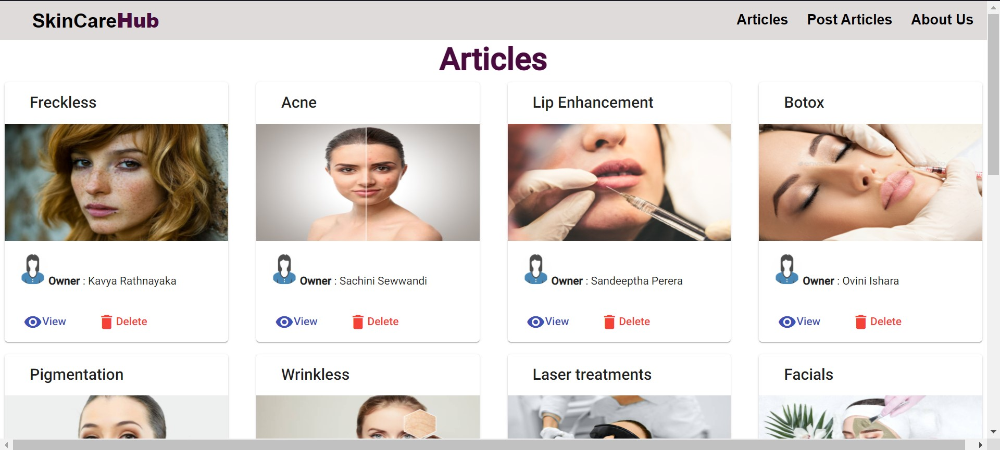
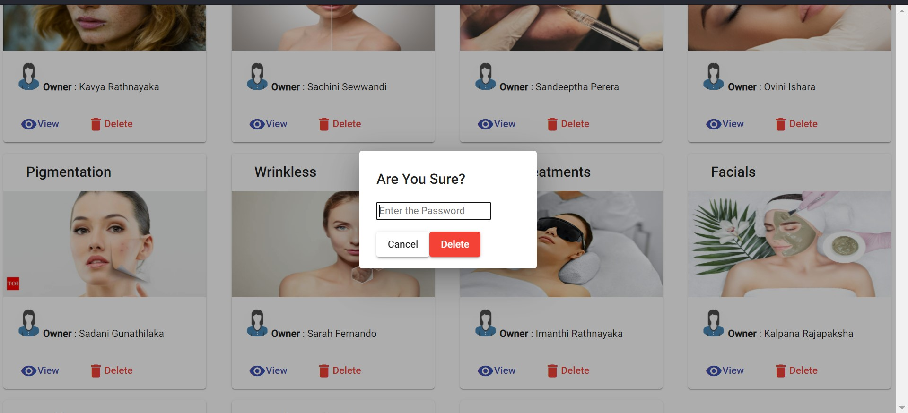
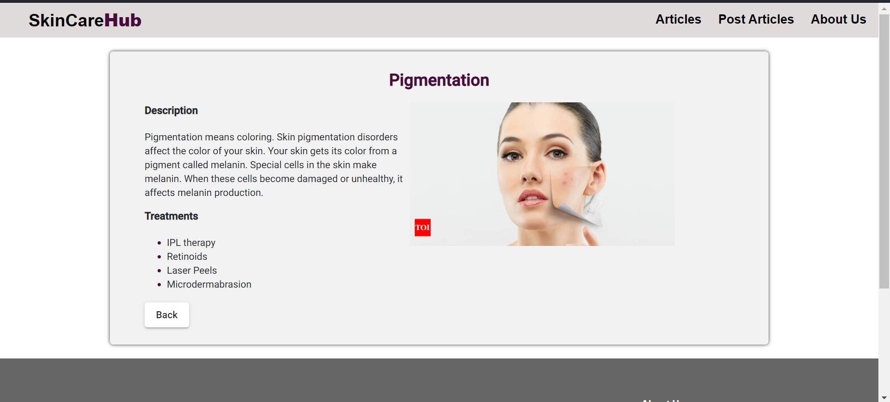
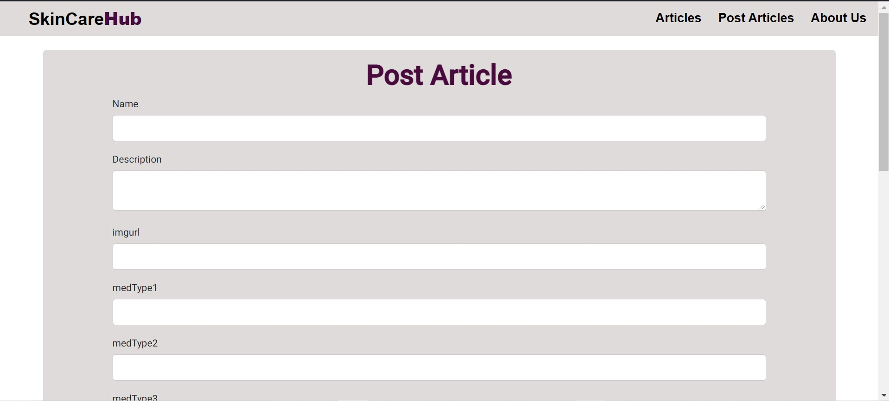
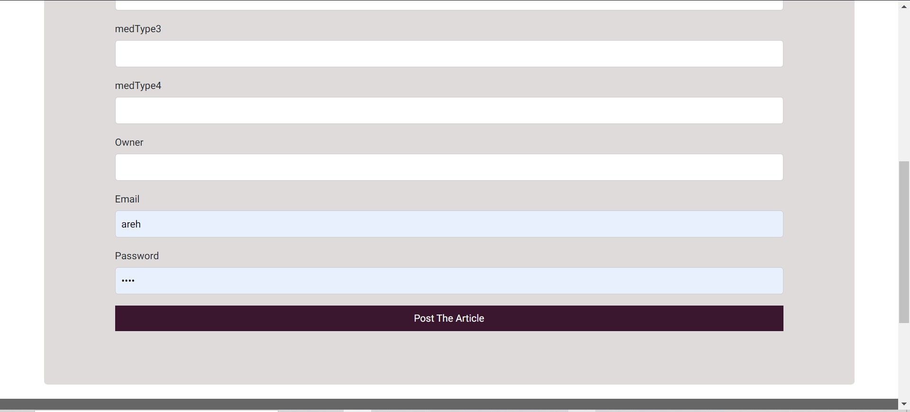
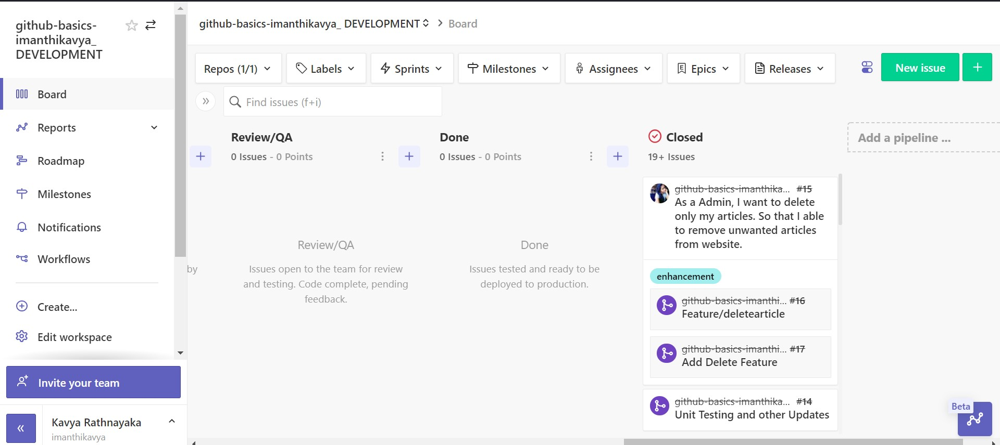

# 👋 SkinCareHub

This is a simple website that can post articles,  delete articles and view articles. There is no login feature but in every article posting, we collect their password. The user who has a relevant password for the related article can delete that article. As an example, In a real scenario, the post owner can share the password with one or more members to do changes. This facility enhances security.

### Deployed URL of my web application - https://skinncarehub.herokuapp.com/

## 📙 Used Technologies

- Frontend Framework - Angular
- Backend Framework - SpringBoot
- Database - AWS
- Hosting - Heroku
- Unit Testing Framework - Jasmine |  Test runner - Karma
- Project Management Tool - Zenhub

## User Interfaces

List Articles Page

Delete Article Popup

Single Articles page

Post Article Form

AboutUs page

## ZenHub

### URL
https://app.zenhub.com/workspaces/github-basics-imanthikavya--development-612dd1039a6334001246f8a7/board
### Screenshots

## Hosting - Heroku

- I used Heroku to host my application.

### Frontend workflow

### Backend workflow

## 📝 Unit Testing 
 -  I used Karma as Unit Testing Framework.
 
### ScreenShots

